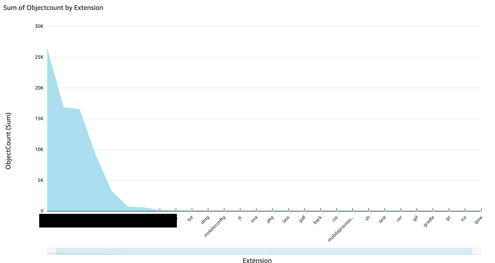
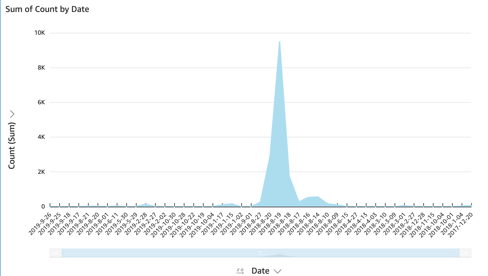

Analysis Techniques
-------------------

- [Analysis Techniques](#analysis-techniques)
  - [Athena Table Format](#athena-table-format)
  - [Fields](#fields)
    - [Key](#key)
      - [File Extension Analysis](#file-extension-analysis)
      - [Bucket Content Validation](#bucket-content-validation)
      - [Discovering Banned Content](#discovering-banned-content)
      - [File Name Analysis](#file-name-analysis)
      - [Manual Backup Verification](#manual-backup-verification)
    - [size](#size)
    - [e_tag](#e_tag)
      - [Antivirus Scanner/Vulnerability Scanner](#antivirus-scannervulnerability-scanner)
    - [replication_status](#replication_status)
    - [encryption_status](#encryption_status)
    - [last_modified_date](#last_modified_date)
      - [Stale buckets](#stale-buckets)
      - [Stale prefixes (first level folder) inside a bucket](#stale-prefixes-first-level-folder-inside-a-bucket)
    - [object_lock_retain_until_date](#object_lock_retain_until_date)
    - [object_lock_mode](#object_lock_mode)
    - [object_lock_legal_hold_status](#object_lock_legal_hold_status)
    - [Storage class](#storage-class)
  - [Visualization](#visualization)

### Athena Table Format
Once the platform [<u>harvests inventory files from all source buckets</u>](user_guide.md#analysis-run), it
creates a partitioned Athena table backed by the consolidated S3 inventory data. You can read the table definition [<u>here</u>](https://docs.aws.amazon.com/AmazonS3/latest/dev/storage-inventory.html#storage-inventory-athena-query). In addition to these system default columns, the platform adds the following partition columns to the table:

| **Column Name** | **Description**                                                                                                                                                                                                                                                                                |
|-----------------|------------------------------------------------------------------------------------------------------------------------------------------------------------------------------------------------------------------------------------------------------------------------------------------------|
| account         | The identifier for the account that owns a given S3 bucket. This column is useful for analyzing S3 buckets under a specific account.                                                                                                                                                           |
| region          | The region under which a given S3 bucket exists. This column is useful for analyzing buckets under a specific region.                                                                                                                                                                          |
| bucketname      | The name of the S3 bucket. This is useful for analyzing a specific S3 bucket. The inventory files themselves contain a field named *bucket* with the same information. The difference between these two columns is that *bucketname* is partitioned, whereas the default field is not. |

### Fields
Let's look at a few interesting S3 inventory fields and how we can derive inferences from these fields. If your Athena queries time out, you should split the analysis across more than one query by leveraging the partition columns specified above.

#### Key

This is the object key name that uniquely identifies the object in the bucket.

##### File Extension Analysis

-   Certain file types are known to contain secrets. For example:
      - .pfx, .key, .gpg and .asc may contain private cryptographic materials
      - .tfstate & .tfvars may contain Terraform deployment secrets
      - .publishsettings files may contain Azure secrets

    `select * from {ATHENA_TABLE} where (lower(substr(key,-4)) in ('.pfx', '.key','.gpg', '.asc')) or (lower(substr(key,-8)) in ('.tfstate')) or (lower(substr(key,-7)) in ('.tfvars')) or (lower(substr(key,-16)) in ('.publishsettings'))`

-   This analysis can also be used for prioritizing resources for other initiatives. For example, if you would like to run an anti-malware scan on S3 objects; then it may be better to scan executables, office docs, and source code files before scanning other file types.

    `select * from {ATHENA_TABLE} where (lower(substr(key,-3)) in ('.sh', '.js', '.py', '.go', '.cs')) or (lower(substr(key,-4)) in ('.exe','.bat','.com','.jar', '.dmg', '.app', '.deb', '.doc', '.xls','.ppt','.pot','.pps', '.pdf', '.ps1')) or (lower(substr(key,-5)) in ('.docx', '.docm', '.xlsx','.xlsm', '.pptx', '.pptm'))`

-  This can also provide insights into the kinds of files users are storing in S3. The following query will give you a count of S3 objects by extension.

    `select reverse(split(split(reverse(lower(key)),'/')[1], '.')[1]) as Extension, count(*) from {ATHENA_TABLE} where position('.' in split(reverse(lower(key)),'/')[1]) > 0 group by reverse(split(split(reverse(lower(key)),'/')[1], '.')[1])`

    If the above query times out, then you can use the following query to discover distinct file extensions in your environment.

    `select distinct reverse(split(split(reverse(lower(key)),'/')[1], '.')[1]) as Extension from {ATHENA_TABLE} where position('.' in split(reverse(lower(key)),'/')[1]) > 0`

##### Bucket Content Validation

If you expect certain buckets to contain only specific files, then you can validate the assumption by using this property. For example, if you have a public S3 bucket that's only supposed to contain static web content such as image and video files, then you can run the following query to validate this assumption.

`select * from {ATHENA_TABLE} where bucketname = '{BUCKET_NAME}' and(lower(substr(key,-4)) not in ('.bmp', '.jpg', '.gif','.avi', '.flv', '.wmv', '.mp4', '.mov')) and (lower(substr(key,-5)) not in ('.jpeg'))`

##### Discovering Banned Content

If your corporate policy has banned certain content like P2P torrent sharing, you can use the following query to discover banned files in your S3 environment:

`select * from {ATHENA_TABLE} where (lower(substr(key,-8)) in ('.torrent'))`

##### File Name Analysis

Files with certain specific names are known to contain sensitive information. Here are a few examples:
- credentials (AWS access keys)
- client\_secret.json, token.pickle, credentials.json (GCP & GSuite secret
keys)
- passwd and shadow (Unix user passwords)
- id\_rsa (SSH keys)

`select * from {ATHENA_TABLE} where (lower(substr(key,-6)) in ('passwd', 'shadow', 'id_rsa')) or (lower(substr(key,-11)) in ('credentials')) or (lower(substr(key,-12)) in ('token.pickle')) or (lower(substr(key,-16)) in ('credentials.json')) or (lower(substr(key,-18)) in ('client_secret.json'))`

##### Manual Backup Verification

If you have a custom pipeline to back up S3 objects from one bucket into another bucket, you can use the following query to ensure that you have a backup of all applicable S3 objects.

`select  s3inventory.key, s3inventoryclone.key from s3inventory left outer join  s3inventoryclone on s3inventory.key = s3inventoryclone.key and s3inventory.size = s3inventoryclone.size where s3inventory.bucketname = '<SOURCE BUCKET>' and s3inventoryclone.bucketname = '<CLONED BUCKET>' and s3inventoryclone.key is null`

#### size

We can use this property to discover backups and dumps by writing a query to discover large objects (e.g., greater than 1 GB). This technique's accuracy could be further improved by finding large files with specific extensions (for example, .sql for database backups).

`select * from {ATHENA_TABLE} where size > 1073741824`

#### e_tag

Depending upon how an S3 object was created, this field may contain the object's MD5 hash. This field is useful for detecting the presence of specific files in your S3 environment.

##### Antivirus Scanner/Vulnerability Scanner

ETag can be used to perform hash-matching based antivirus scans across your S3 environment by comparing the MD5 hashes against MD5 hashes of known malware. There are a few open-source anti-malware projects that can provide you these hashes. To perform this check, create a text file with virus hashes and upload it in an S3 bucket in the same region. For example:

Name:

*hashes.txt*

Content:

*0cc175b9c0f1b6a831c399e269772661*

*92eb5ffee6ae2fec3ad71c777531578f*

*…*

Create an Athena table in the same database which would allow you to join this file with the S3 inventory data:

```
create external table `hashcollection`(
  `hash` string)
row format delimited
  fields terminated by ','
stored as inputformat
  'org.apache.hadoop.mapred.TextInputFormat'
OUTPUTFORMAT
  'org.apache.hadoop.hive.ql.io.HiveIgnoreKeyTextOutputFormat'
LOCATION
  's3://<BUCKET_NAME>/'
```

You can run the following query to discover S3 objects that match with these virus hashes:

`select * from {ATHENA_TABLE} left Join hashcollection ON s3inventory.e_tag = hashcollection.hash`

Similarly, if you host executables and source code in S3, then ETag could be used for detecting outdated and vulnerable libraries by comparing MD5 hashes.

#### replication_status

A common use case for the S3 replication feature is to create automatic backups. We can use this field to ensure that all relevant S3 objects have been replicated to create a backup copy.

`select * from {ATHENA_TABLE} where replication_status <> 'COMPLETED'`

#### encryption_status

AWS provides several server-side encryption options. We can use the
field to validate that all objects under a given bucket are encrypted
using a specific server-side encryption option. For example, we can use
this query to confirm that all objects are server-side encrypted using a
customer-provided encryption key (SSE-C).

`select * from {ATHENA_TABLE} where bucketname = '{BUCKET_NAME}' and encryption_status <> 'SSE-C'`

#### last_modified_date

last_modified_date can be used for analyzing if a given bucket is in use. This analysis is also useful if you have shared buckets where different services own different S3 prefixes.

##### Stale buckets

`select bucketname, max(last_modified_date) as lastcreatefiletimestamp, count(*) as objectcount, sum(size) as totalsize from {ATHENA_TABLE} group by bucketname`

##### Stale prefixes (first level folder) inside a bucket

`select split(key,'/')[1] as topfolder, max(last_modified_date) as lastcreatefiletimestamp, count(*) as objectcount, sum(size) as totalsize from {ATHENA_TABLE} where bucketname='{BUCKET_NAME}' group by split(key,'/')[1]`

#### object_lock_retain_until_date

#### object_lock_mode

#### object_lock_legal_hold_status

If you are using object locks to satisfy regulatory/compliance/legal requirements, you can use the following query to validate that all relevant S3 objects are indeed locked. For example, if you would like to verify that all objects are locked in compliance mode, you can use the following Athena query:

`select * from {ATHENA_TABLE}  where object_lock_mode = 'compliance'`

#### Storage class

This field can be used along with the last modified time to discover S3 objects and buckets that can be moved to a lower-tier storage class for cost optimization.

### Visualization

[<u>AWS QuickSight</u>](https://aws.amazon.com/quicksight/) supports Athena as a data source. You can visualize Athena results using QuickSight by following [<u>these steps</u>](https://docs.aws.amazon.com/quicksight/latest/user/create-a-data-set-athena.html). For example, by using the following query for a test bucket, I generated a QuickSight chart to show the number of objects by file extension.

`select reverse(split(split(reverse(lower(key)),'/')[1], '.')[1]) as Extension, count(*) as ObjectCount from {ATHENA_DATABASE}.{ATHENA_TABLE} where bucketname='{BUCKET_NAME}' and position('.' in split(reverse(lower(key)),'/')[1]) > 0 group by reverse(split(split(reverse(lower(key)),'/')[1], '.')[1])`



Similarly, by using the following Athena query, we can create A QuickSight chart showing a timeline of how objects were created in the bucket. We see that there was a huge spike between 2018/08 to 2018/09, where most of the bucket objects were created. We also see that no new objects have been created in the bucket since 2019/09.

`select date_format(last_modified_date,'%Y-%c-%d') as Date, count(*) as Count from {ATHENA_DATABASE}.{ATHENA_TABLE} where bucketname='{BUCKET_NAME}' group by date_format(last_modified_date,'%Y-%c-%d')`


