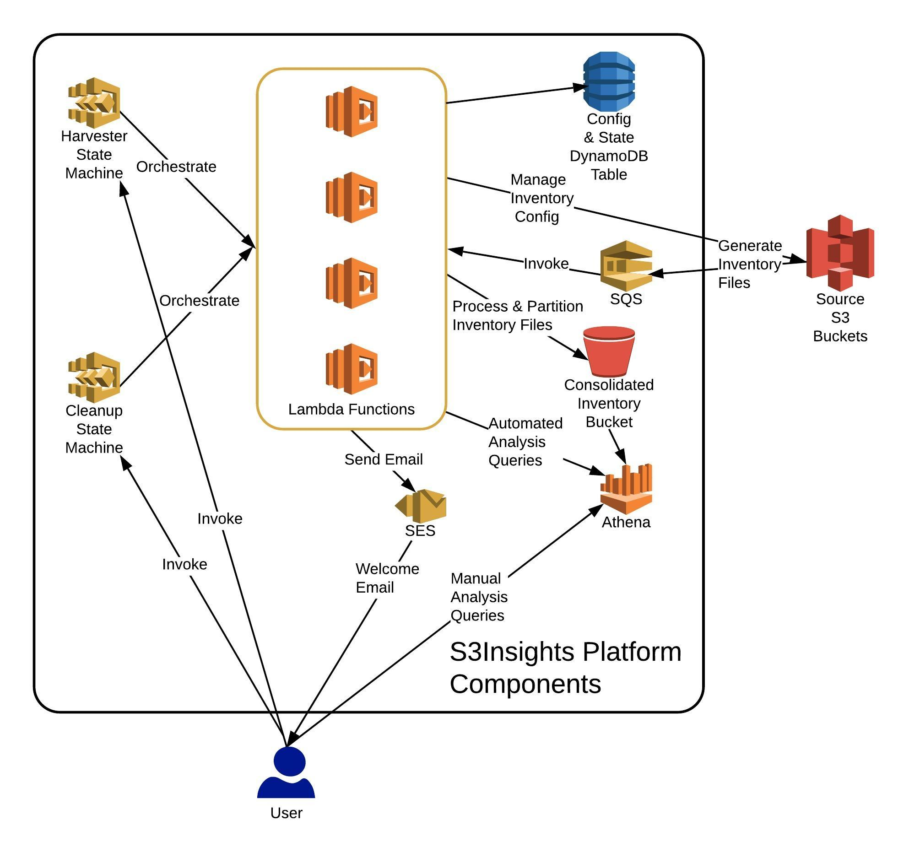
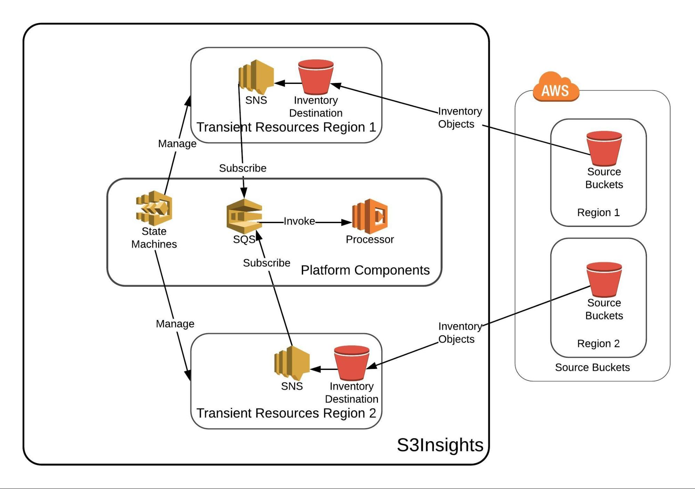
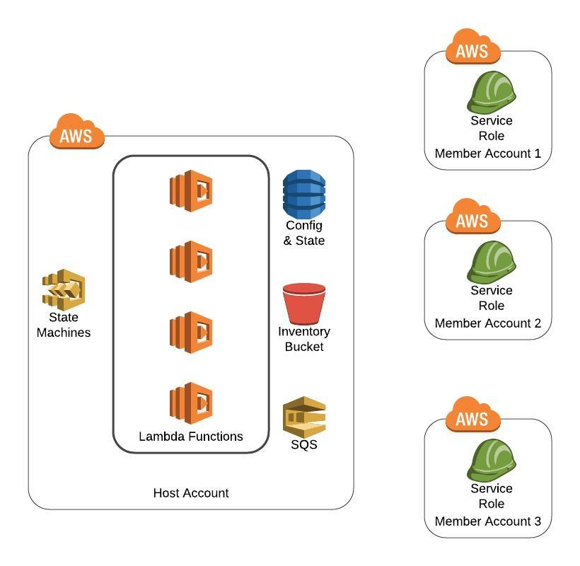
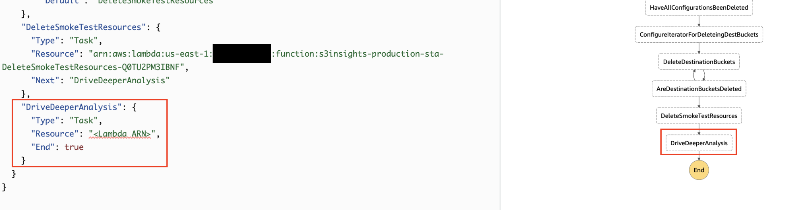

Architecture
------------
- [Architecture](#architecture)
  - [Introduction](#introduction)
  - [Platform Components](#platform-components)
    - [State Machine](#state-machine)
      - [Harvester](#harvester)
      - [Cleanup](#cleanup)
    - [Lambda functions](#lambda-functions)
    - [IAM](#iam)
      - [Lambda IAM Role](#lambda-iam-role)
      - [State Execution Role](#state-execution-role)
      - [Cross Account IAM Role](#cross-account-iam-role)
    - [DynamoDB](#dynamodb)
    - [S3](#s3)
    - [Athena](#athena)
    - [SQS](#sqs)
    - [SES](#ses)
    - [CloudFormation/SAM templates](#cloudformationsam-templates)
  - [Transient Resources](#transient-resources)
    - [S3](#s3-1)
    - [SNS](#sns)
  - [User Interactions](#user-interactions)
  - [Deployment in AWS](#deployment-in-aws)
  - [Runtime behavior](#runtime-behavior)
  - [Extensibility](#extensibility)

### Introduction
For scalability, modularity, and cost-effectiveness; S3Insights exclusively relies on AWS serverless technologies. At a high level, S3Insights consists of two AWS Step Function [<u>State Machines</u>](#state-machine) that orchestrate several Lambda functions. S3Insights takes an Infrastructure-as-Code(IaC) approach by providing self-contained CloudFormation/SAM templates to build out its infrastructure.

### Platform Components

When the [<u>primary CloudFormation template</u>](user_guide.md#host-account) is deployed, it creates several AWS resources inside the host account. You can take snapshots of your S3 environment as often as you like by executing the [<u>Harvester State Machine</u>](architecture.md#harvester). The following AWS resources are shared between all Harvester State Machine executions.

#### State Machine

##### Harvester

This is the primary State machine that harvests and analyzes inventory details from all applicable S3 buckets. Each execution of this State Machine captures the current snapshot of the S3 environment by gathering an inventory of all S3 objects. Under normal circumstances, users would only use this State Machine.

##### Cleanup

If a harvester execution fails for some reason or a user cancels a harvester execution manually, then the Cleanup State Machine can clean up [<u>transient AWS resources</u>](#transient-resources). All cleanup steps are also part of the Harvester State Machine, so if a Harvester run is successful, then this State Machine doesn’t need to be executed. I have tried to build the cleanup tasks in a fault-tolerant manner so that you can run the State Machine multiple times without any adverse side effects.

#### Lambda functions

All State Machine steps are implemented using Lambda functions. The platform also contains a Lambda function outside of these State Machines to process S3 inventory files.

#### IAM

The platform leverages the following three IAM roles:

##### Lambda IAM Role

All Lambda functions leverage this IAM role for making AWS API calls.

##### State Execution Role

The State Machines use this IAM role for orchestrating the execution of relevant Lambda functions.

##### Cross Account IAM Role

The platform relies on a cross account IAM role to include source buckets outside of the host account to support the multi-account model.

#### DynamoDB

DynamoDB is the persistent data store for the platform. A DynamoDB table is used for storing state details and sharing information between different Step Function states.

#### S3

An [<u>S3 bucket</u>](https://docs.aws.amazon.com/AmazonS3/latest/dev/UsingBucket.html) is used for housing consolidated and partitioned inventory files from all source buckets. Athena analysis queries are executed against the inventory files stored in this bucket.

#### Athena

[<u>Athena</u>](https://aws.amazon.com/athena/) is the analysis engine of the platform. Once all inventory files are in the consolidated inventory S3 bucket, the platform executes automated Athena queries. Users can also manually run Athena queries. The platform creates a new Athena table for each Harvester State Machine execution.

#### SQS

An SQS queue receives S3 notification events from all [<u>transient inventory destination buckets</u>](#s3-1). It invokes a Lambda function to process inventory files and store them in the consolidated S3 bucket.

#### SES

The last step of the Harvester State Machine sends a welcome email to users. The platform uses AWS SES for sending this welcome email.

#### CloudFormation/SAM templates

The platform leverages these technologies to describe its infrastructure as code. It also simplifies deployment and maintenance.

The diagram below shows how these components, along with source S3 buckets & users, interact with one another.

### Transient Resources

When a Harvester run is executed, the platform deploys [<u>a CloudFormation template</u>](https://github.com/kurmiashish/S3Insights/blob/master/s3insights/lib/template/inventory-destination.json) in all supported regions to create a few transient AWS resources. The primary reason for creating these temporary resources is that S3 requires a destination bucket for storing inventory files in the same region as the source bucket. These transient resources are required to capture inventory files, process them for internal state management, and partition them in the consolidated S3 bucket for efficient analysis. The Harvester State Machine cleans up these transient resources once they are no longer needed. You can also force the platform to clean up these temporary resources by running the Cleanup State Machine.

#### S3

An inventory destination bucket is created for capturing inventory files from all buckets in the region. This is a staging bucket where inventory files are stored temporarily before they get processed by the inventory object process Lambda function.

#### SNS

SNS is used for building a notification pipeline by creating an [<u>S3 notification event</u>](https://docs.aws.amazon.com/AmazonS3/latest/dev/NotificationHowTo.html) on the inventory destination bucket. SNS topics in all regions forward these notifications to [<u>the SQS queue</u>](#sqs). SNS does not support cross-region Lambda invocation, but SQS does. This design allows the platform to process S3 notification events with one centralized instance of the inventory object Lambda function instead of having one separate Lambda function in each region.

The following architecture diagram shows the high-level interaction between various S3Insights components.

### User Interactions

There are three interaction points for the user.

1.  The user provides the input parameter to [<u>begin a Harvester State Machine execution</u>](user_guide.md#how-to-initiate-a-state-machine-execution). Once a Harvester execution has started, the platform doesn’t rely on any other user input. Similarly, the user can also execute the Cleanup State Machine if required.
2.  Once a Harvester execution finishes successfully, S3Insights sends a welcome email to the recipients specified in the input parameter. This welcome email includes:
    1.  A summary of the source S3 buckets that were included in the run along with their inventory status.
    2.  Automated Athena queries that were executed by the platform along with AWS web console links to view the responses.
3.  Users also have the option to [<u>run Athena queries manually</u>](user_guide.md#running-athena-analysis-queries-manually) once an S3Insights snapshot is ready.

### Deployment in AWS

This section provides a high-level overview of S3Insights deployment. You can find step by step deployment instructions in the [<u>User Guide</u>](user_guide.md). S3Insights is deployed in a host AWS account. This account hosts all the [<u>platform components</u>](#platform-components) as well as runtime [<u>transient resources</u>](#transient-resources). If you have S3 buckets outside of the host account that you would like to include in the analysis, then you would need to deploy the [<u>cross-account IAM role</u>](#cross-account-iam-role) CloudFormation template in these accounts. The IAM role would allow the platform to manage S3 inventories for those buckets.

The following diagram shows the simplified architecture once these CloudFormation templates are deployed in the host and other member accounts.

### Runtime behavior

This section describes how different platform components interact with each other during an [<u>analysis run</u>](user_guide.md#analysis-run).

To begin a Harvester execution, the user provides input parameters. Once a Harvester State Machine execution is kicked off, the following workflow is orchestrated:

1.  In all supported regions inside the host account, the platform deploys a CloudFormation template to create the required [<u>transient resources</u>](#transient-resources).

2.  The platform configures all source buckets to generate S3 inventory and store inventory files in the appropriate inventory destination S3 bucket. It would also send out SES email verification requests if required.

3.  As inventory files are generated, they are processed by the inventory object processor Lambda function. It consolidates and partitions these objects to make Athena analysis efficient. The function also manages the inventory status for all source buckets in the DynamoDB table.

4.  Once an inventory report has been generated for a source bucket, the platform removes the inventory configuration created in \#2 to prevent further inventory reports.

5.  Once inventory reports from all S3 buckets have been received, the platform creates an Athena table on top of the consolidation S3 bucket. The platform also has a timeout value for this step.

6.  The platform runs Athena queries and waits for them to finish.

7.  Once Athena queries have finished, the platform sends a welcome email to the recipients specified in the input parameters.

8.  At the last step, the platform deletes all transient resources created in \#1 from the host account. The user can also execute this step separately by executing the Cleanup State Machine.

### Extensibility

There are a few options to support extensibility scenarios to let S3Insights drive other S3 related initiatives. For example, an enterprise AWS customer might want to run an anti-malware scan on S3 objects. In this case, the customer can run the anti-malware scanner only on the objects flagged by S3Insights. An efficient way to implement such scenarios would be to introduce a new step immediately after the Harvester State Machine's last step. In this step, your Lambda function can read the Athena responses and drive other S3 initiatives based on the results.

