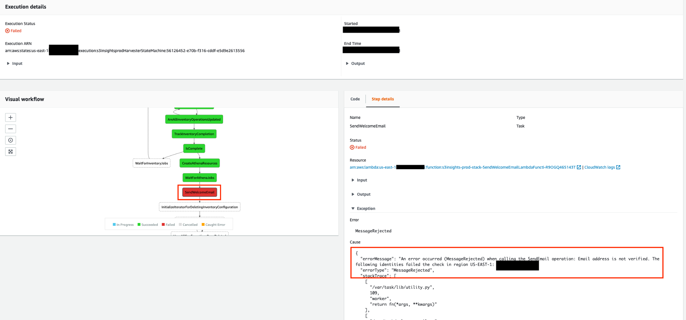
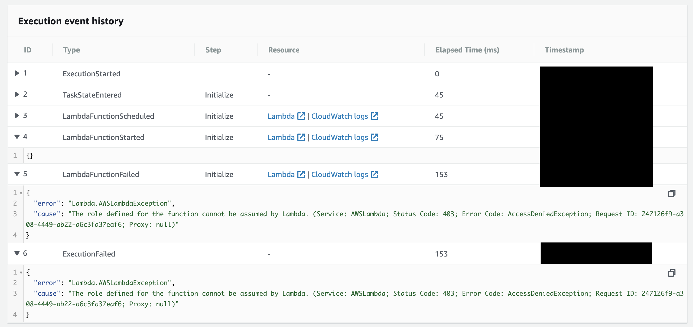
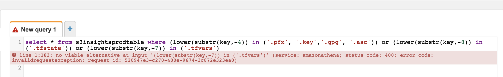

Troubleshooting
---------------
Sometimes things go wrong. This section provides several pointers about the issues we might encounter with S3Insights, along with what we can do about them.

- [Troubleshooting](#troubleshooting)
  - [Harvester Failures](#harvester-failures)
  - [Athena Failures](#athena-failures)
  - [Inventory Generation Failures](#inventory-generation-failures)

### Harvester Failures
-   If your execution fails for some reason, go to the failed step to find the root cause. You can also find more details in CloudWatch for the failed Lambda function.

    

-   While developing the platform, I encountered a few IAM related transient issues when trying to run the Harvester State Machine immediately after deploying the host CloudFormation template. These issues disappeared on their own after I re-tried the scenario after a few minutes. I don't know the root cause yet, but I am guessing this happens because of the [<u>eventual consistency model</u>](https://docs.aws.amazon.com/IAM/latest/UserGuide/troubleshoot_general.html#troubleshoot_general_eventual-consistency).

    

### Athena Failures

If an Athena query fails, then you can follow these steps to
troubleshoot:

-   Make sure that the query is syntactically correct. If there are
    syntax issues, then the AWS web console would show you an
    appropriate error message. \
    

-   If the query fails because of resource exhaustion

    -   Try to optimize the query. [<u>This performance tuning
        blogpost</u>](https://aws.amazon.com/blogs/big-data/top-10-performance-tuning-tips-for-amazon-athena/)
        for Athena goes over some tips you can follow to optimize the
        query.

    -   If the query causes resource exhaustion even after optimization, partition the query based on one or more partitioned columns added by the framework. One strategy you can use for grouping buckets together is by making sure that each group has inventory information for no more than a specific number of objects. You can run the following Athena query to find the number of inventory records created for each bucket: \
        `select bucketname, count(*) from {ATHENA_TABLE} group by bucketname`

### Inventory Generation Failures

When you receive a welcome email, it includes inventory status for all source buckets included in the analysis. If you don't see a bucket in the list, make sure that the bucket region and account were included in the input parameter. Ideally, all buckets should either be in **done** or **bucket\_is\_empty** state. However, other states represent potential issues with the Harvester's ability to gather inventory files from source buckets.

| **Status**                             | **Description**                                                                                                                                                                                                                                                           |
|----------------------------------------|---------------------------------------------------------------------------------------------------------------------------------------------------------------------------------------------------------------------------------------------------------------------------|
| done                                   | The platform was able to harvest inventory files from the bucket                                                                                                                                                                                                          |
| bucket\_is\_empty                      | AWS doesn't generate any inventory objects if the bucket is empty. This is by design. The platform handles such buckets by putting them in **bucket\_is\_empty** state.                                                                                                   |
| inventory\_configuration\_not\_created | The platform was not able to create the required inventory configuration on the bucket. This is likely due to a permission issue. You should look at the Bucket Policy, Service Control Policy and any other authorization policy applicable to the IAM role. |
| bucket\_not\_available                 | The bucket got deleted during the Harvester execution run.                                                                                                                                                                                                                |
| in\_progress                           | The execution finished due to timeout before the platform could process all inventory files for the bucket.                                                                                                                                                               |
| bucket\_access\_lost                   | The platform somehow lost access to the bucket after it was able to create inventory configuration. Please follow the troubleshooting steps described for **inventory\_configuration\_not\_created** status.                                                              |