User Guide
--------

This section provides step by step instructions to deploy and use the platform in
an enterprise AWS environment.

- [User Guide](#user-guide)
- [Deployment](#deployment)
  - [Prerequisites](#prerequisites)
  - [Deployment Steps](#deployment-steps)
    - [Host Account](#host-account)
    - [Member Accounts](#member-accounts)
    - [SES](#ses)
      - [Recipient](#recipient)
      - [Sender](#sender)
- [Usage](#usage)
  - [How to initiate a State Machine execution](#how-to-initiate-a-state-machine-execution)
  - [Step Function Execution Input](#step-function-execution-input)
    - [Sample Input](#sample-input)
  - [Smoke Test](#smoke-test)
  - [Analysis Run](#analysis-run)
  - [Failed Execution](#failed-execution)
  - [Running Athena Analysis Queries Manually](#running-athena-analysis-queries-manually)

## Deployment
### Prerequisites

Before you can deploy S3Insights in your AWS environment, you need to
have the following AWS tools installed on your machine.

- [<u>AWS
CLI</u>](https://docs.aws.amazon.com/cli/latest/userguide/cli-chap-install.html)
- [<u>AWS SAM
CLI</u>](https://docs.aws.amazon.com/serverless-application-model/latest/developerguide/serverless-sam-cli-install.html)

### Deployment Steps

#### Host Account

Follow these steps to deploy S3Insights.

1.  Choose a host account and a region to host the SAM application. Make sure that this region supports all the required AWS services as described in the [<u>architecture section</u>](architecture.md). I recommend choosing the region that contains the maximum number of S3 objects. This is because if [<u>staging</u>](architecture.md#s3-1) and [<u>consolidation</u>](architecture.md#s3) buckets are in the same region, then it would speed up the inventory file processing step for the source buckets in that region. If you don’t have a preference, I would recommend using either *us-east-1* or *us-west-2* as I have tested the platform in these two regions.

2.  [<u>Configure your AWS CLI
    environment</u>](https://docs.aws.amazon.com/cli/latest/userguide/cli-chap-configure.html)
    for the host account. If you are planning to include other AWS
    accounts in the analysis, it may be useful to create
    [<u>named
    profiles</u>](https://docs.aws.amazon.com/cli/latest/userguide/cli-configure-profiles.html)
    for each account to run CLI commands for multiple AWS
    accounts concurrently. If you are using named profiles,
    you would need to attach the --*profile* parameter in all the CLI
    commands included in this section.

3.  [<u>Create a bucket</u>](https://docs.aws.amazon.com/cli/latest/reference/s3api/create-bucket.html) for storing the SAM deployment artifacts. The bucket
    needs to be in the region you chose in step 1. \
    -    For us-east-1: `aws s3api create-bucket --bucket `**`<BUCKET_NAME>`** `--region `**`us-east-1`**
    -    For other regions: `aws s3api create-bucket --bucket `**`<BUCKET_NAME>`** `--create-bucket-configuration LocationConstraint=`**`<REGION>`**

    For example: \
    `aws s3api create-bucket --bucket `**`s3insights-deployment-artifacts-123456789012-us-east-1`** `--region ` **`us-east-1`**

4.  Clone the S3Insights repository and go to the root folder. \
    `git clone https://github.com/kurmiashish/S3Insights.git` \
    `cd S3Insights`

5.  Package the SAM application. \
    `sam package --output-template-file packaged.yaml --s3-bucket `**`<BUCKET_NAME>`** `--region` **`<REGION>`**

    For example:
    ```
    sam package --output-template-file packaged.yaml --s3-bucket s3insights-deployment-artifacts-123456789012-us-east-1 --region us-east-1

    Successfully packaged artifacts and wrote output template to file packaged.yaml.

    Execute the following command to deploy the packaged template

    aws cloudformation deploy --template-file /Users/demouser/S3Insights/packaged.yaml --stack-name <YOUR STACK NAME>
    ```

6.  Deploy the SAM application. For this step, you would need to choose
    a deployment name. The deployment name is used as a prefix to create
    temporary resources. This design allows us to have multiple S3Insights instances to coexist in the same account.

    `sam deploy --template-file packaged.yaml --stack-name` **`<DEPLOYMENT_NAME>`**`-stack --capabilities CAPABILITY_NAMED_IAM --parameter-overrides  DeploymentName=`**`<DEPLOYMENT_NAME>`** `--region` **`<REGION>`**

    For example:

    ```
    sam deploy --template-file packaged.yaml --stack-name s3insightsprod-stack --capabilities CAPABILITY_NAMED_IAM  --parameter-overrides DeploymentName=s3insightsprod --region us-east-1

    Waiting for changeset to be created..

    Waiting for stack create/update to complete

    Successfully created/updated stack - s3insightsprod-stack
    ```


7.  Discover the host account id if you would like to analyze S3 buckets outside of this account. The host account id would be required
    for deploying the cross-account CloudFormation template in other
    AWS accounts ([<u>Member Accounts</u>](#member-accounts)->Step #2).

    `aws sts get-caller-identity`

    For example:

    ```
    aws sts get-caller-identity

    {

    "Account": "123456789012",

    "UserId": "123456789012:user",

    "Arn": "arn:aws:sts::123456789012:federated-user/user"

    }
    ```

#### Member Accounts

You would need to deploy a cross-account role you if would like to include S3 buckets from other AWS accounts. Repeat these steps for all member accounts.

1.  [<u>Configure your AWS CLI environment</u>](https://docs.aws.amazon.com/cli/latest/userguide/cli-chap-configure.html) for the member account.

2.  Deploy the cross-account CloudFormation template. We would need to provide the same deployment name as above. We will also need the host account id.

    `aws cloudformation deploy --template-file crossaccountiamrole.yaml --stack-name `**`<DEPLOYMENT_NAME>`**`-cross-account-stack --capabilities CAPABILITY_NAMED_IAM --parameter-overrides DeploymentName=`**`<DEPLOYMENT_NAME>`**` HostAccountID=`**`<HOST_AWS_ACCOUNT_ID>`** `--region `**`<REGION>`**

    For example:

    `aws cloudformation deploy --template-file crossaccountiamrole.yaml --stack-name` **`s3insightsprod`**`-cross-account-stack --capabilities CAPABILITY_NAMED_IAM --parameter-overrides DeploymentName=`**`s3insightsprod`** `HostAccountID=`**`123456789012`** `--region `**`us-east-1`**

At this point, S3Insights is ready to use. You can see the platform
resources by visiting the CloudFormation stack in the [<u>AWS Web
Console</u>](https://console.aws.amazon.com/) inside the host account.

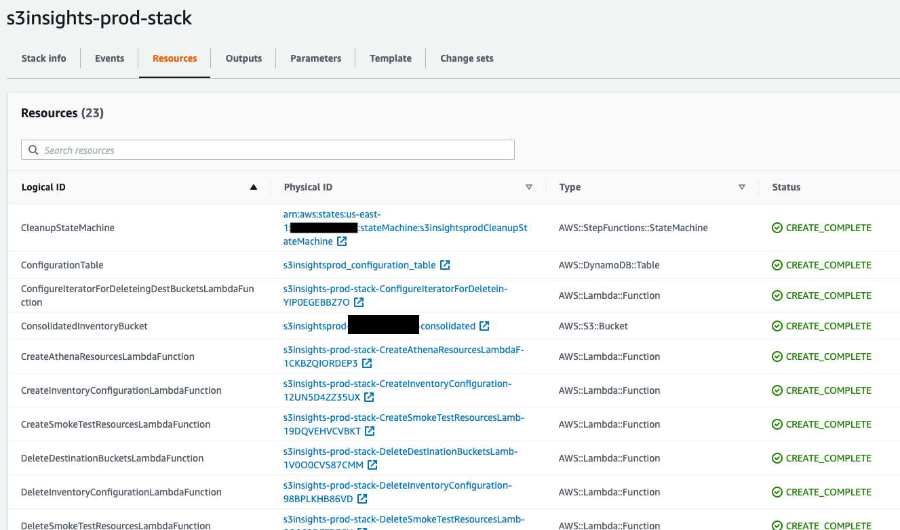

#### SES

The platform sends a welcome email with all the information at the end
of successful [<u>Harvester</u>](architecture.md#harvester) executions. For this functionality, we would
need to provide the sender as well as recipient email addresses. You can
provide any valid email address, including your personal email as `sender_email_address`
& `recipient_email_addresses`. However, under the default configuration,
we would have to verify these email addresses at least once because of
the [<u>SES sandbox
requirements</u>](https://docs.aws.amazon.com/ses/latest/DeveloperGuide/request-production-access.html).
You can see the verified email addresses and domains by following the
instructions listed
[<u>here</u>](https://docs.aws.amazon.com/ses/latest/DeveloperGuide/list-email-addresses-procedure.html).

##### Recipient

Because of the [<u>SES sandbox
requirements</u>](https://docs.aws.amazon.com/ses/latest/DeveloperGuide/request-production-access.html),
you would need to verify all recipient email addresses once. When you
execute the [<u>Harvester State Machine</u>](architecture.md#harvester) for the first time, ask all
recipients to check their inbox/spam and click on the verification link.
When running a smoke test, you would have only a few minutes to perform
email verification. Optionally, if you want to avoid the rush, you can
[<u>verify</u>](https://docs.aws.amazon.com/ses/latest/DeveloperGuide/verify-email-addresses.html)
all recipients offline before starting the State
Machine execution.

##### Sender

If you use your personal email as the sender, AWS would send the
welcome email on your behalf without the appropriate DKIM signature. In
this case, the welcome email would most likely end up in the SPAM
folder. I highly recommend using a [<u>verified
domain</u>](https://docs.aws.amazon.com/ses/latest/DeveloperGuide/verify-domains.html)
with the appropriate DKIM DNS records as the sender to prevent this scenario. You can follow these
steps to create a verified SES domain.

1.  If you don’t have a domain, you can buy one from AWS by following [<u>these steps</u>](https://docs.aws.amazon.com/Route53/latest/DeveloperGuide/registrar.html).

2.  Once you have a domain (either with AWS or a third-party domain
    registrar), you can create a new subdomain and host it over
    [<u>AWS Route 53</u>](https://aws.amazon.com/route53/). For
    example, if you own *abc.com*, then you can create
    *s3insights.abc.com* and host it over a Route 53 public Host Zone
    by following [<u>these
    steps</u>](https://docs.aws.amazon.com/Route53/latest/DeveloperGuide/AboutHZWorkingWith.html).
    Since you are creating a new subdomain, this wouldn't impact any
    other use cases of the domain.

    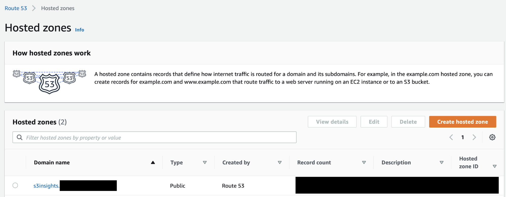

3.  At this point, you can kick off the SES domain verification process. Make sure that you select *Generate DKIM Settings* checkbox.

    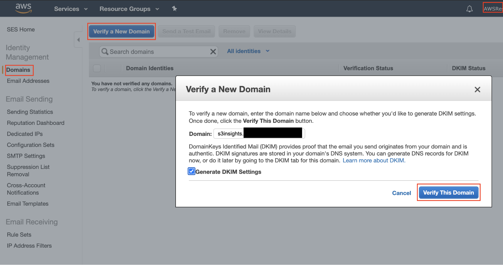

4.  On the next screen, you would see the instruction to create the required DNS records. Since the subdomain is hosted on Route53, you would also see an option to let AWS create these records for you with one click. Let’s use this option.

    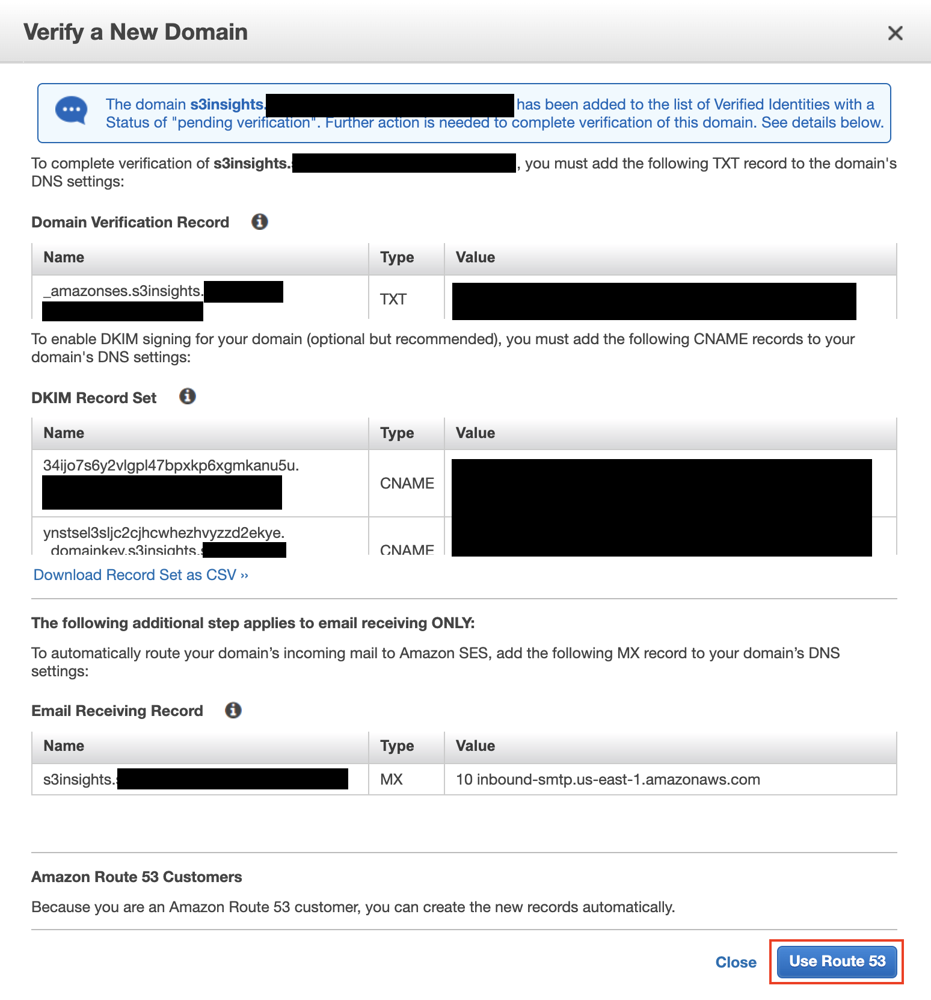

5.  The domain would move to the pending state. In a couple of minutes, it would move to the verified state on its own.

    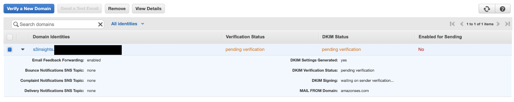

    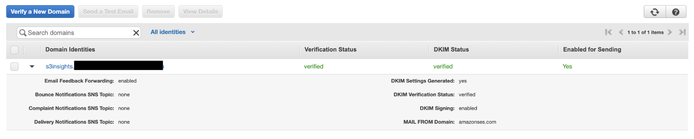

6.  At this point, you can use this domain to send welcome emails. For example, you can specify *no-reply@s3insights.abc.com* as the value for the `sender_email_address` input parameter.

A practical approach would be to use your personal email address as both sender and recipient for PoC purposes. Once you are ready for production scenarios, I recommend using a verified domain with the appropriate DKIM DNS records.

## Usage
### How to initiate a State Machine execution

Once the host SAM template has been deployed in the host account, go to
the CloudFormation Stack and click on **Physical ID** link for
**HarvesterStateMachine** to open the State Machine.

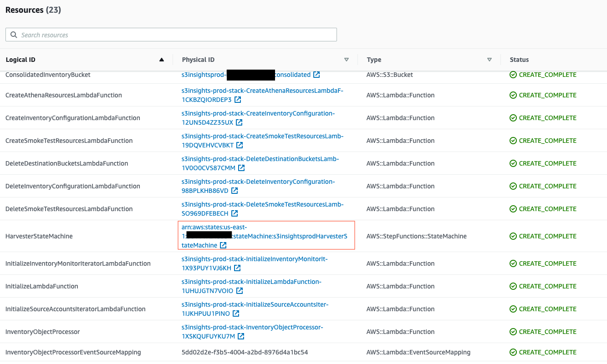

Once here, you can kick off a new execution by clicking on **Start
Execution**.

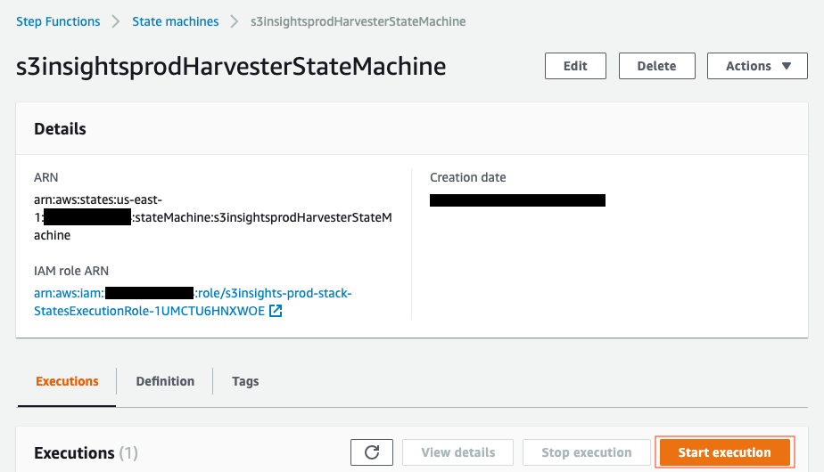

You can only have one Harvester State Machine execution instance at a
time. If you want to have multiple execution instances concurrently,
 you should create multiple S3Insights deployments with different
deployment names.

To begin execution, you would have to manually enter the
execution input (more details are provided [<u>below</u>](#step-function-execution-input)). This is the only
required user action. Once execution has begun, no user actions would
be required. Once a Harvester run is finished, the system would send a
welcome email to all recipients included in the input.

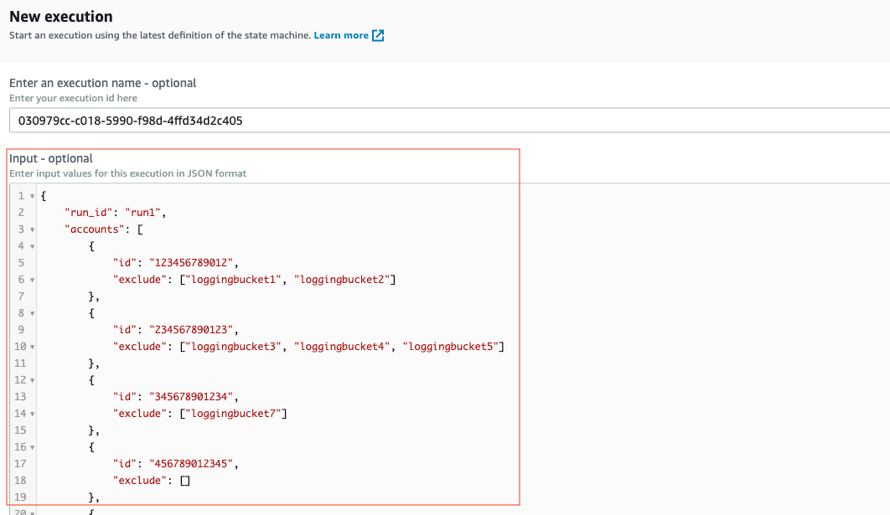

### Step Function Execution Input

The platform accepts input via the State Machine input parameter. You
would have to enter the input json manually in **New Execution** pop up
window. Harvester does not need a value for **execution name**, you can
leave this field empty/with the default value. **Input** is a JSON
object in the following format:

```
{
    "run_id": "RUN_ID",
    "accounts": [
       <LIST OF ACCOUNT ACCOUNTS TO INCLUDE IN THE ANALYSIS>
       {
            "id": "ACCOUNT_ID",
            "exclude": [LIST OF BUCKETS TO EXCLUDE]
        }
    ],
    "athena_database_name": "ATHENADATABASENAME",
    "athena_table_name": "ATHENATABLENAME",
    "is_smoke_test": IS_SMOKE_TEST,
    "athena_queries": [
       <LIST OF ATHENA QUERIES TO RUN ONCE INVENTORIES HAVE BEEN PROCESSED>
       {
            "name":"QUERY_NAME",
            "query": "QUERY"
        }
    ],
    "sender_email_address": "SENDER_EMAIL_FOR_SES_NOTIFICATION",
    "recipient_email_addresses": [LIST_OF_RECIPIENTS_FOR_WELCOME_EMAIL],
    "supported_regions": [LIST_OF_SUPPORTED_REGIONS]
}
```
Let’s go over all attributes one by one.

| **Name**                    | **Description**                                                                                                                                                                                                                                                                   |
|-----------------------------|-----------------------------------------------------------------------------------------------------------------------------------------------------------------------------------------------------------------------------------------------------------------------------------|
| run\_id                     | An identifier for this specific State Machine execution. The platform uses a combination of deployment name and run\_id as a prefix for all [<u>temporary resource</u>](architecture.md#transient-resources) names. It should be an alphanumeric string with a length of 1-8 characters.                                          |
| accounts                    | An array of JSON objects that describes the accounts to be included in the analysis. It consists of two attributes:1. `id`: AWS Account ID 2. `exclude`: Optional list of S3 buckets that should be excluded for making Athena analysis efficient, for example, logging buckets. |
| athena\_database\_name      | Once all inventory files have been processed, the platform would create this Athena database if it doesn’t exist already.                                                                                                                                                         |
| athena\_table\_name         | This Athena table would be created under the *athena\_database\_name* Athena database. All analysis queries would be executed against this table. Make sure this table doesn’t exist yet.                                                                                         |
| is\_smoke\_test             | Specifies whether this is a smoke test execution. More details on this option are provided [<u>below</u>](#smoke-test).                                                                                                                                                             |
| athena\_queries             | List of Athena queries to be executed automatically. Please refer to the [<u>Analysis Technique</u>](analysis_techniques.md) section to learn more about these Athena queries.                                                                                                      |
| sender\_email\_address      | Sender email address to be used for sending the welcome email. Please refer to the [<u>SES deployment step</u>](#sender) for more details about this parameter.                                                                                                                    |
| recipient\_email\_addresses | This the list of email addresses that would receive the welcome email. Please refer to the [<u>SES deployment step</u>](#recipient) for more details about this parameter.                                                                                                            |
| supported\_regions          | List of supported regions for this execution. If a source bucket is not in one of these regions, it wouldn't be included.                                                                                                                                                   |

#### Sample Input

You can use the following text as a template for authoring input
parameters for your AWS environment.
```
{
    "run_id": "run1",
    "accounts": [
        {
            "id": "123456789012",
            "exclude": ["loggingbucket1", "loggingbucket2"]
        },
        {
            "id": "234567890123",
            "exclude": []
        },
        {
            "id": "345678901234",
            "exclude": ["loggingbucket7"]
        },
        {
            "id": "456789012345",
            "exclude": []
        }
    ],
    "athena_database_name": "analysisdatabase",
    "athena_table_name": "analysistable",
    "is_smoke_test": false,
    "athena_queries": [
        {
            "name":"large dumps",
            "query": "select * from {ATHENA_TABLE} where size > 1000000000000"
        },
        {
            "name":"secrets",
            "query": "select * from {ATHENA_TABLE} where (lower(substr(key,-4)) in ('.pfx', '.key','.gpg', '.asc')) or (lower(substr(key,-6)) in ('passwd', 'shadow', 'id_rsa')) or (lower(substr(key,-7)) in ('.tfvars'))  or (lower(substr(key,-8)) in ('.tfstate')) or (lower(substr(key,-11)) in ('credentials')) or (lower(substr(key,-12)) in ('token.pickle')) or (lower(substr(key,-16)) in ('.publishsettings', 'credentials.json')) or (lower(substr(key,-18)) in ('client_secret.json'))"
        },
       {
            "name":"src files executables and docs",
            "query": "select * from {ATHENA_TABLE} where (lower(substr(key,-3)) in ('.sh', '.js', '.py', '.go', '.cs')) or (lower(substr(key,-4)) in ('.exe','.bat','.com','.jar', '.dmg', '.app', '.deb', '.doc', '.xls','.ppt','.pot','.pps', '.pdf', '.ps1')) or (lower(substr(key,-5)) in ('.docx', '.docm', '.xlsx','.xlsm', '.pptx', '.pptm'))"
        }
    ],
    "sender_email_address": "no-reply@verifieddomain.com",
    "recipient_email_addresses": ["user1@emaildomain.com","user2@emaildomain.com"],
    "supported_regions": ["ap-south-1", "eu-west-3", "eu-west-2", "eu-west-1", "ap-northeast-2", "ap-northeast-1", "sa-east-1", "ca-central-1", "ap-southeast-1", "ap-southeast-2", "eu-central-1", "us-east-1", "us-east-2", "us-west-1", "us-west-2"]
}

```


### Smoke Test

As AWS may take [<u>up to 48
hours</u>](https://docs.aws.amazon.com/AmazonS3/latest/user-guide/configure-inventory.html)
to generate inventory reports, we can perform a quick smoke test to ensure that the pipeline is working as expected. The smoke test takes
about 10-15 minutes for verifying all configurations. You should use the
input parameter that you want to use for your actual Harvester run,
except for the following two properties:

-   `run_id`: Use a different run\_id
-   `is_smoke_test`: Set this to true

For example:
```
{
    "run_id": "test1",
    ...
    "is_smoke_test": true,
    ...
}
```

1.  You can start a smoke test run by providing the modified input parameters.
    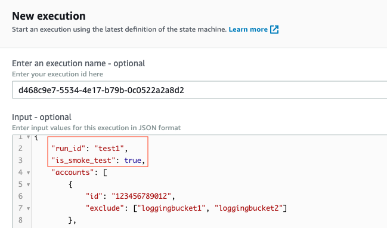

2.  Once the smoke test is kicked off, the console will take you to the execution details page. You can see all the Harvester State Machine tasks on this page.
    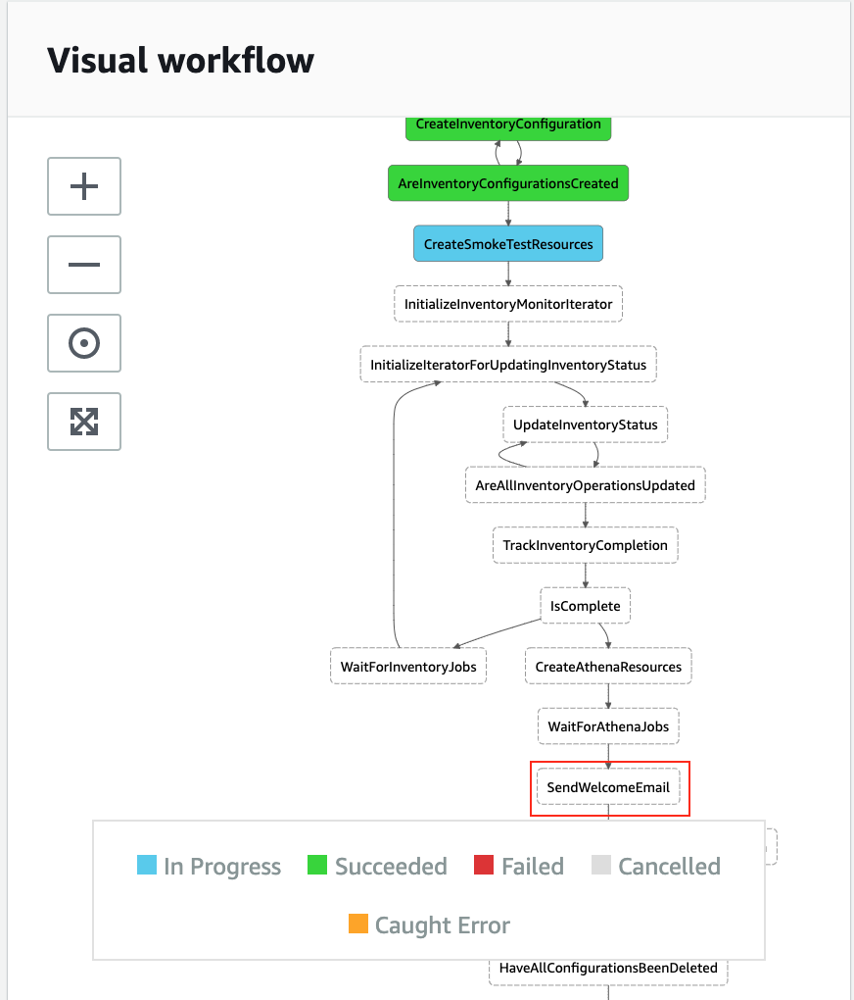

3.  Verify the sender and recipient email addresses if required before the execution reaches **SendWelcomeEmail** state. You can do this by clicking on the verification email that AWS sends out to the sender and recipient email addresses. The AWS verification email may land in your SPAM folder.

    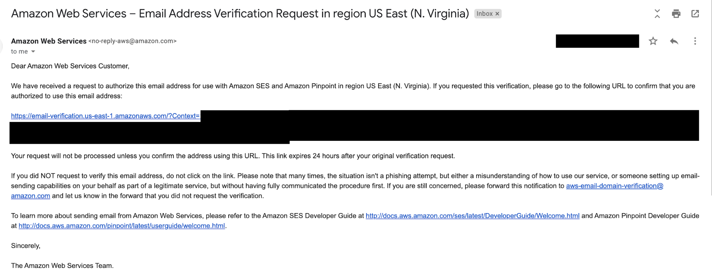


4.  The smoke test execution would take a few minutes, depending upon the number of accounts and source buckets.

5.  If it’s successful, you will receive a welcome email. Just like the verification email, this email may land in your SPAM folder. Please refer to the [<u>SES setup instructions</u>](#ses) that describe a way to prevent welcome emails from landing in SPAM.

    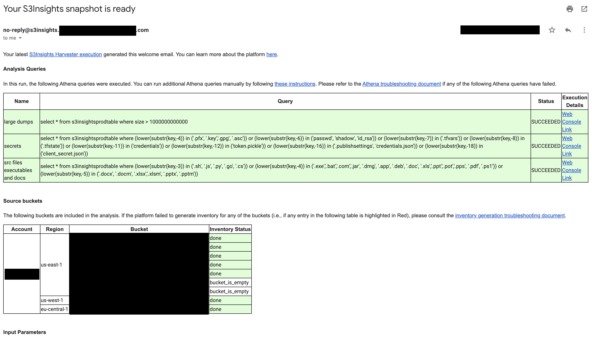

6.  At the end of the test run, the platform would automatically delete all smoke test resources.

### Analysis Run

Once a smoke test execution finishes successfully, you can move onto an
actual run. The Step Functions web console allows you to kick off a new
execution using the last input parameters. After a successful smoke test
execution, click **New Execution** to kick off a new execution by
changing the following two parameters:
-   `run_id`: Use a distinct run\_id
-   `is_smoke_test`: Set this to false

For example:
```
{
    "run_id": "prod1",
    ...
    "is_smoke_test": false,
    ...
}
```

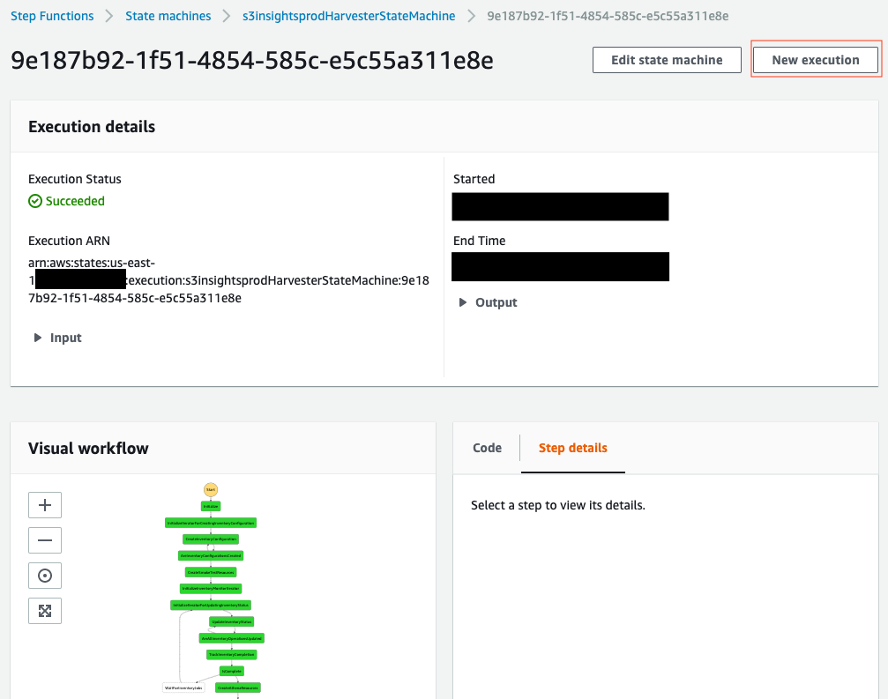

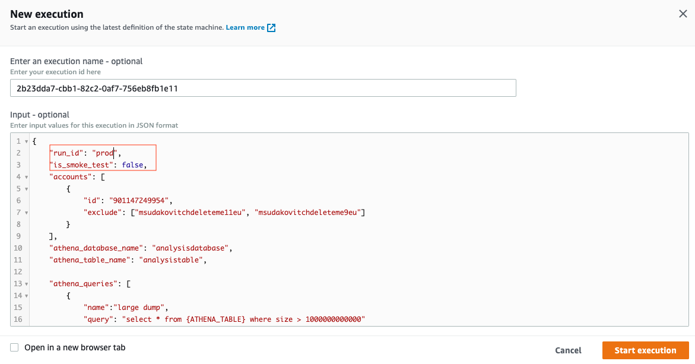


It may take up to 48 hours to generate all inventory data. After all
inventory jobs have finished, the system would send out a welcome email
to all recipient email addresses included in the input parameter. There
is also a timeout for the waiting step.

To track the progress of a Harvester run, you can open the current
execution in the web console and see the progress in **Visual workflow**
section. The steps highlighted in Green have finished. The step
highlighted in Blue is currently being executed.

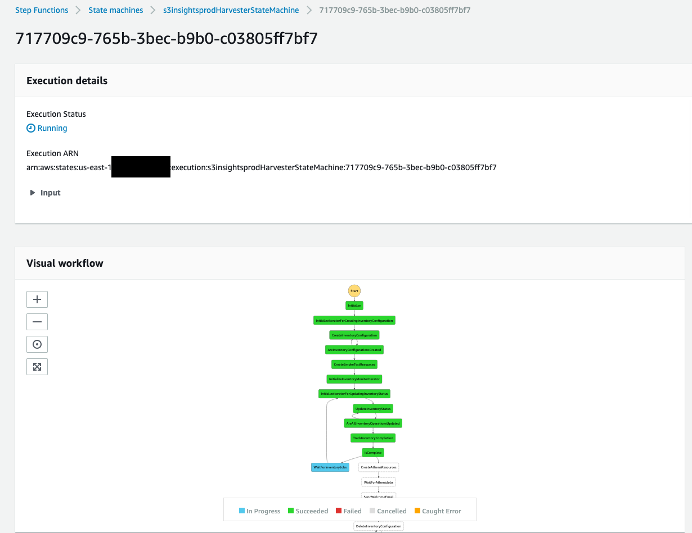

The State Machine spends most of the time tracking
the progress of inventory jobs. If you want to know the status of each
source bucket, you can manually query the DynamoDB table to find
inventory job status for individual buckets as shown below.


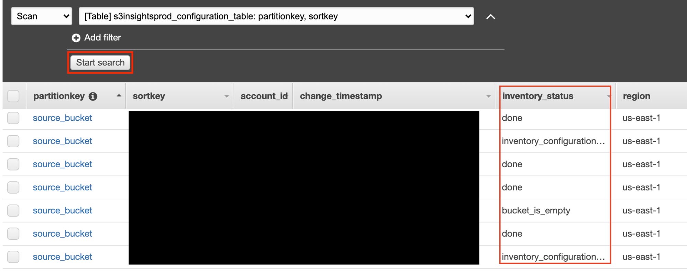

Please consult the [<u>Harvester troubleshooting document</u>](troubleshooting.md#harvester-failures) in case your State Machine execution fails.

### Failed Execution

A failed execution may leave behind a few [<u>temporary resources</u>](architecture.md#transient-resources). To
clean them up, you should create a new [<u>cleanup State Machine</u>](architecture.md#cleanup) execution before starting a new
[<u>Harvester</u>](architecture.md#harvester) execution. It’s important to run the cleanup State Machine
before starting a new execution of Harvester. Otherwise, the DynamoDB state
information required to clean up the [<u>transient resources</u>](architecture.md#transient-resources) would
get overwritten. You don’t need to provide an execution name, you can
leave this field empty/with the default value. You should use the input
given below:

```
{
"manual_cleanup": true
}
```
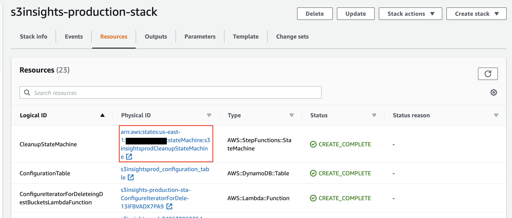

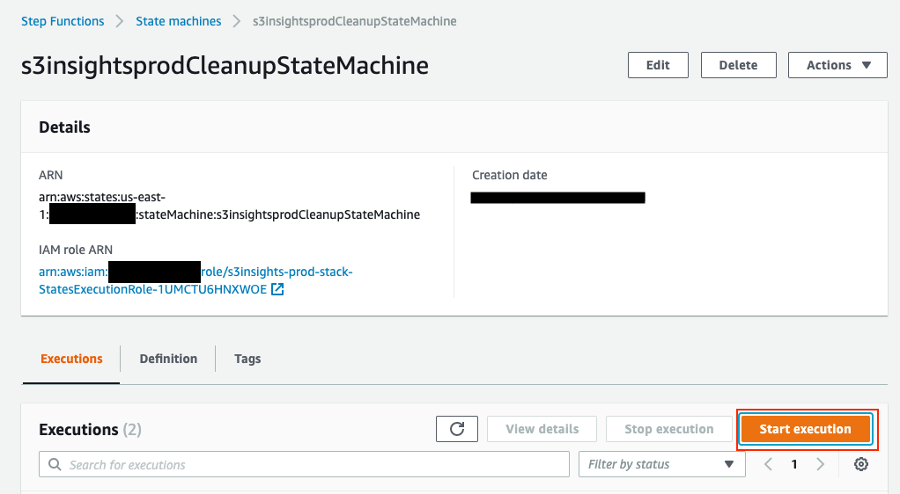

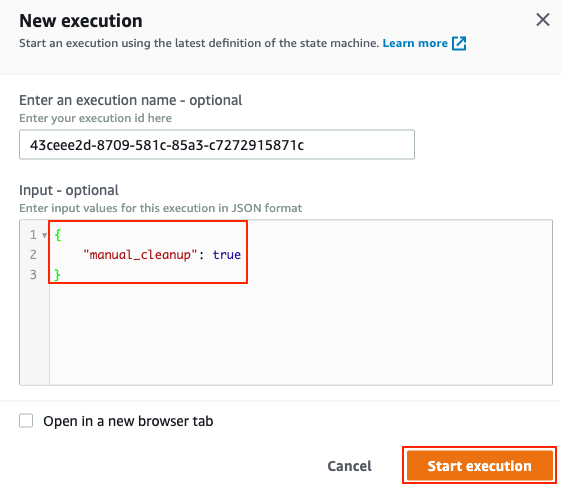

### Running Athena Analysis Queries Manually

Once a Harvester execution has finished (i.e., when recipients receive
a welcome email), you can also run ad hoc Athena queries on the
inventory data. The easiest way to do this would be to click on any
Athena links included in the welcome email to go to the Athena web
experience with the correct Athena database preselected. Once you land
on this page, you can manually write Athena queries here. The
[<u>Analysis Techniques</u>](analysis_techniques.md) section can help you
explore different ways to gather insights from this data.

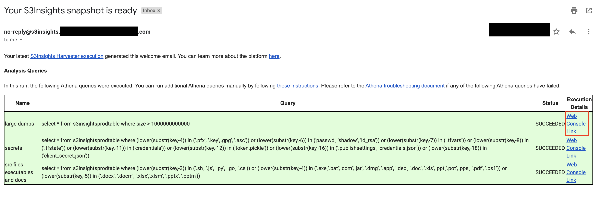

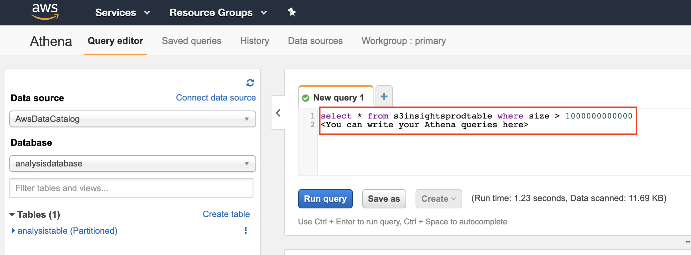