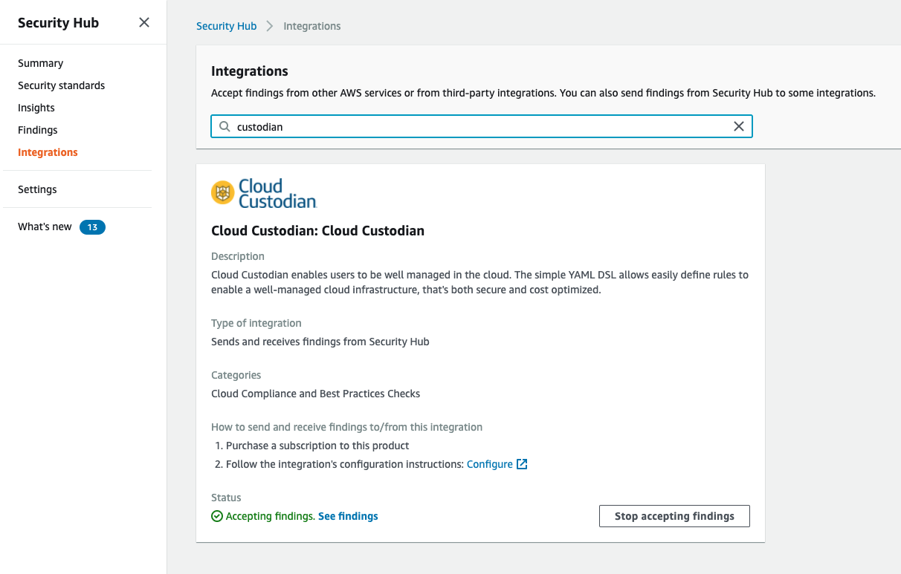

.. _aws-securityhub:

Security Hub
------------

Security Hub gives a centralized dashboard of security events across data feeds from many different
tools.

Custodian supports deep integration with security hub to support the following use cases.

 - post and update findings on any resource type to security hub
   See :ref:`post-finding action <aws.common.actions.post-finding>`

 - filtering resources on the basis of extant findings
   See :ref:`finding filter <aws.common.filters.finding>`

 - lambda execution mode triggered on ingestion of security hub findings
   `mode: hub-finding`

 - lambda execution mode as a custom action in the security hub ui. Note custodian
   security hub actions work against both findings and insights.
   `mode: hub-action`

Getting Started
+++++++++++++++

To post findings with cloud-custodian (v0.9+) you need to enable the
product integration from the security hub console. From the left side
menu click integrations, search for Cloud Custodian, and enable the
Cloud Custodian integration.

Modes
+++++

Execute a policy lambda in response to security hub finding event or action.

This policy will provision a lambda and security hub custom action.
The action can be invoked on a finding or insight result (collection
of findings). The action name will have the resource type prefixed as
custodian actions are resource specific.

.. code-block:: yaml

   policies:
     - name: remediate
       resource: aws.ec2
       mode:
         type: hub-action
         role: MyRole
       actions:
        - snapshot
        - type: set-instance-profile
          name: null
        - stop

This policy will provision a lambda that will process high alert findings from
guard duty (note custodian also has support for guard duty events directly).

.. code-block:: yaml

   policies:
     - name: remediate
       resource: aws.iam
       mode:
         type: hub-finding
	 role: MyRole
       filters:
         - type: event
           key: detail.findings[].ProductFields.aws/securityhub/ProductName
           value: GuardDuty
         - type: event
           key: detail.findings[].ProductFields.aws/securityhub/ProductName
           value: GuardDuty
       actions:
         - remove-keys

Note, for custodian we support additional resources in the finding via the Other resource,
so these modes work for resources that security hub doesn't natively support.

https://docs.aws.amazon.com/securityhub/latest/userguide/securityhub-cloudwatch-events.html

The Amazon Security Finding Format is documented at https://docs.aws.amazon.com/securityhub/latest/userguide/securityhub-findings-format.html

.. list-table:: Mapping data in Cloud Custodian into the Amazon Security Finding Format (ASFF)
   :widths: 40 20 40
   :header-rows: 1

   * - Cloud Custodian
     - ASFF Attribute
     - Rationale
   * - derived from execution context: account_id
     - AwsAccountId
     - Direct
   * - metadata.json policy.actions.compliance_status
     - Confidence
     - User supplied value in policy configuration
   * - metadata.json policy.actions.confidence 
     - Confidence
     - User supplied value in policy configuration
   * - metadata.json policy.actions.criticality
     - Criticality
     - User supplied value in policy configuration
   * - derived value: current_time aka Now
     - CreatedAt 
     - Timestamp when the finding record was composed for the first time
   * - metadata.json policy.actions.description
     - Description
     - User supplied value in policy configuration
   * - metadata.json policy.name
     - GeneratorId
     - Policy is equivilent to a Rule
   * - digest of region, account_id, policy contents, and Resource Arn/Id 
     - Id
     - Enforces uniqueness by combinding policy attributes with resource attributes
   * - metadata.json policy.resource_type
     - ProductFields.resource
     - Direct
   * - fixed value: CloudCustodian
     - ProductFields.ProviderName
     - Name of project
   * - derived value from executable: version
     - ProductFields.ProviderVersioN
     - Direct
   * - fixed value: ACTIVE
     - RecordState
     - Always ACTIVE at Create/Update time
   * - metadata.json policy.actions.recommendation
     - Recommendation.Text
     - User supplied value in policy configuration
   * - metadata.json policy.actions.recommendation_url
     - Recommendation.Url
     - User supplied value in policy configuration
   * - resources.json attributes
     - Resources.Details.${Type}.*
     - Direct Mapping from columns in Describe output
   * - resources.json Arn
     - Resources.Id
     - Direct
   * - resource.json Tags
     - Resources.Tags
     - Direct
   * - metadata.json policy.resource_type
     - Resources.Type
     - Direct
   * - Hardcoded Fixed Value: "2018-10-08"
     - SchemaVersion
     - Only Valid value
   * - metadata.json policy.actions.severity_label
     - Severity.Label
     - User supplied value in policy configuration
   * - metadata.json policy.actions.severity_normalized
     - Severity.Normalized
     - User supplied value in policy configuration
   * - metadata.json policy.name
     - Title
     - Primary Identifer
   * - metadata.json policy.actions.types
     - Types
     - User supplied value in policy configuration
   * - derived value: current_time aka Now
     - UpdatedAt
     - Timestamp when the finding record update is composed
