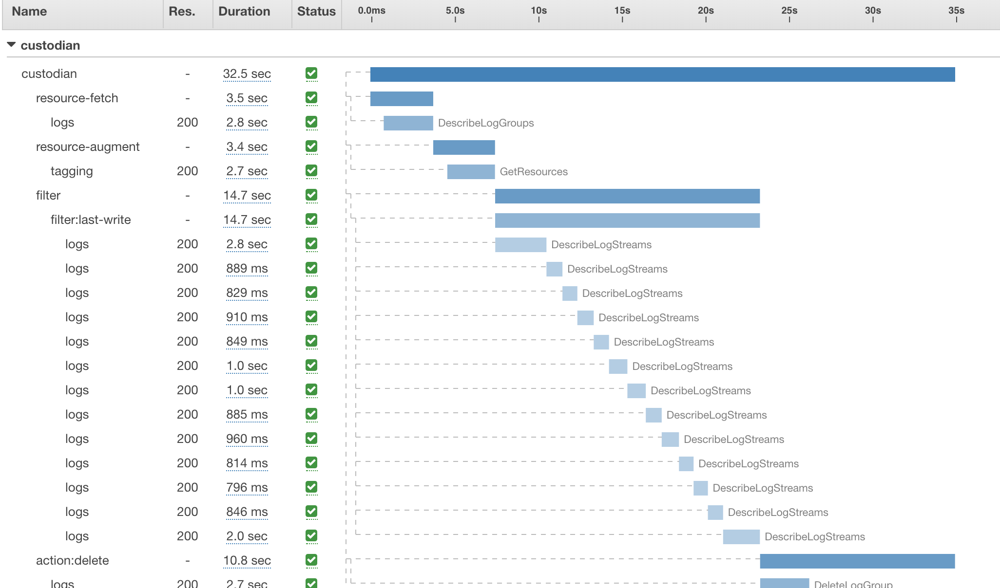

AWS X-Ray Support
-----------------

Custodian supports tracing policy execution using `AWS X-Ray
<https://aws.amazon.com/xray/>`

As a pre-requisite the `aws_xray_sdk` package must be installed.

`pip install aws_xray_sdk`

The package comes pre-installed on the custodian docker images.

The xray support can be enabled on the command line using::

   custodian run -s out --trace xray custodian.yml

Note custodian does not require an X-Ray daemon running as it will stream
traces directly sending to the X-Ray service. It will use the daemon if
the AWS_XRAY_DAEMON_ADDRESS environment variable is set. Lambda policies
should set tracing_config to enable use of the daemon.

By default custodian XRay integration will use the account's xray sampling rules
sampling can be turned off by setting a flag::

    custodian run -s out --trace xray://?sampling=off custodian.yml

Note XRay integration is enabled for the entire process, it cannot be configured
per policy.
