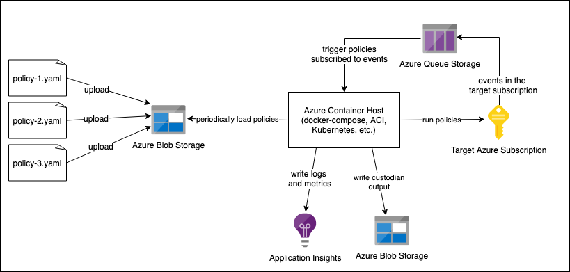
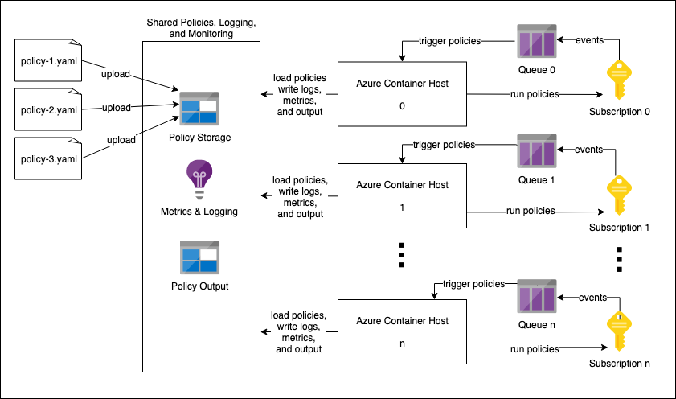

.. _azure_containerhosting:

Azure Container Hosting
=======================

The Azure Container Host is an alternate execution mode for the cloud custodian azure provider.
Running the Azure Container Host is done with the `official custodian docker image <https://hub.docker.com/r/cloudcustodian/c7n>`_.
See the :ref:`ACI <azure_configuration_acitutorial>` and :ref:`Kubernetes <azure_configuration_helmtutorial>` deployment tutorials
to get started running the Azure Container Host.

Overview
########

The Azure Container Host will periodically scan azure blob storage for a set of custodian policies 
to execute in either a periodic or event based mode against a target subscription. For periodic
policies, the container host will execute the policy on the cron schedule that is provided. For event
based policies, the container host maintains an azure queue that subscribes to events in the target
azure subscription.

Once the Azure Container Host is deployed, any policies uploaded to blob storage are automatically 
loaded and running against an Azure Subscription. This makes it very easy to manage and run a large 
number of policies.

It is also possible to configure a set of container hosts to each monitor an Azure Subscription.
This can be useful for monitoring a Management Group or other collections of subscriptions. 
These Container Hosts could be managed with any container orchestration, but we provide the tooling
and :ref:`a tutorial <azure_configuration_helmtutorial>` for deploying container hosts inside 
Kubernetes with a Helm chart.

In this diagram, each Container Host is reading and writing to the same policy and monitoring resources,
but they could each be configured to interact with their own Storage Accounts or Application Insights instances.

Supported Policy Modes
######################

The container host will only run policies with one of the following modes specified. Otherwise, 
the policy will be ignored.

Periodic
^^^^^^^^

Periodic policies must specify a mode with type ``container-periodic`` and a cron schedule. This 
schedule can specify when the policy should run. For example: once every hour, on midnight on every 
weekday, or once a month.

.. code-block:: yaml

    policies:
    - name: run-every-day-at-midnight
      resource: azure.resourcegroup
      mode:
        type: container-periodic
        schedule: '0 0 * * *'

.. c7n-schema:: mode.container-periodic

Event Based
^^^^^^^^^^^

Event based policies must specify a mode with the type ``container-event`` and a set of events that 
will trigger the execution. For example: after a new resource group is created.

.. code-block:: yaml

    policies:
    - name: run-on-new-resource-group
      resource: azure.resourcegroup
      mode:
        type: container-event
        events: 
          - resourceProvider: Microsoft.Resources/subscriptions/resourceGroups
            event: write

.. c7n-schema:: mode.container-event

Configuration
#############

Configuration for the container host is provided as environment variables. 
There are several environment variables specific to the container host:

+-----------------------------------------+----------+--------------------------------------------------------------------------------------------------------------------------------------------------------------------------------------------------------------+
| Variable Name                           | Required | Description                                                                                                                                                                                                  |
+=========================================+==========+==============================================================================================================================================================================================================+
| ``AZURE_CONTAINER_POLICY_URI``          | required | The URL to the azure blob container to load custodian policies from.                                                                                                                                         |
+-----------------------------------------+----------+--------------------------------------------------------------------------------------------------------------------------------------------------------------------------------------------------------------+
| ``AZURE_CONTAINER_STORAGE_RESOURCE_ID`` | required | The resource id of the storage account to hold the event queue.                                                                                                                                              |
+-----------------------------------------+----------+--------------------------------------------------------------------------------------------------------------------------------------------------------------------------------------------------------------+
| ``AZURE_CONTAINER_QUEUE_NAME``          |          | The name of the event queue that the container host will listen on. If this does not exist, it will be created. Defaults to the target subscripition id.                                                     |
+-----------------------------------------+----------+--------------------------------------------------------------------------------------------------------------------------------------------------------------------------------------------------------------+
| ``AZURE_CONTAINER_LOG_GROUP``           |          | The application insights to send log output to. In the format: ``azure://<instrumentation_key_guid>``.                                                                                                       |
+-----------------------------------------+----------+--------------------------------------------------------------------------------------------------------------------------------------------------------------------------------------------------------------+
| ``AZURE_CONTAINER_METRICS``             |          | The application insights to send metrics output to. In the format: ``azure://<instrumentation_key_guid>``.                                                                                                   |
+-----------------------------------------+----------+--------------------------------------------------------------------------------------------------------------------------------------------------------------------------------------------------------------+
| ``AZURE_CONTAINER_OUTPUT_DIR``          |          | The URL of the storage account blob container to send log output to. In the format: ``azure://<storage_account_name>.blob.core.windows.net/<blob_container_name>``.                                          |
+-----------------------------------------+----------+--------------------------------------------------------------------------------------------------------------------------------------------------------------------------------------------------------------+

In addition to the above environment variables, authentication must be provided to the container host.
See :ref:`azure_authentication` for authenticating the container host with an azure identity.

Once an identity has been established, it will need the following roles in azure:

- ``Reader`` and ``Storage Blob Data Contributor`` on the Storage Account that holds the policy files.

- ``Contributor`` and ``Storage Queue Message Processor`` on the Storage Account that the event queue will live in.

- Any other roles that are needed to run the policies that the container host will run. For example, if there is a policy that filters the ``azure.vm`` resource, the ``Reader`` role will be required for the VMs that are in the container host's target subscription.

Running Locally
###############

The container host can be run locally with ``python -m c7n_azure.container_host.host``.
You will need to provide all of the same configuration specified above through either environment 
variables or CLI options. Run ``python -m c7n_azure.container_host.host --help`` for more information.

Deployment Options
##################

For quick deployments, we provide tooling for 2 methods of deploying the Azure Container Host:
:ref:`ACI <azure_configuration_acitutorial>`, and 
:ref:`Kubernetes with a Helm chart <azure_configuration_helmtutorial>`.
