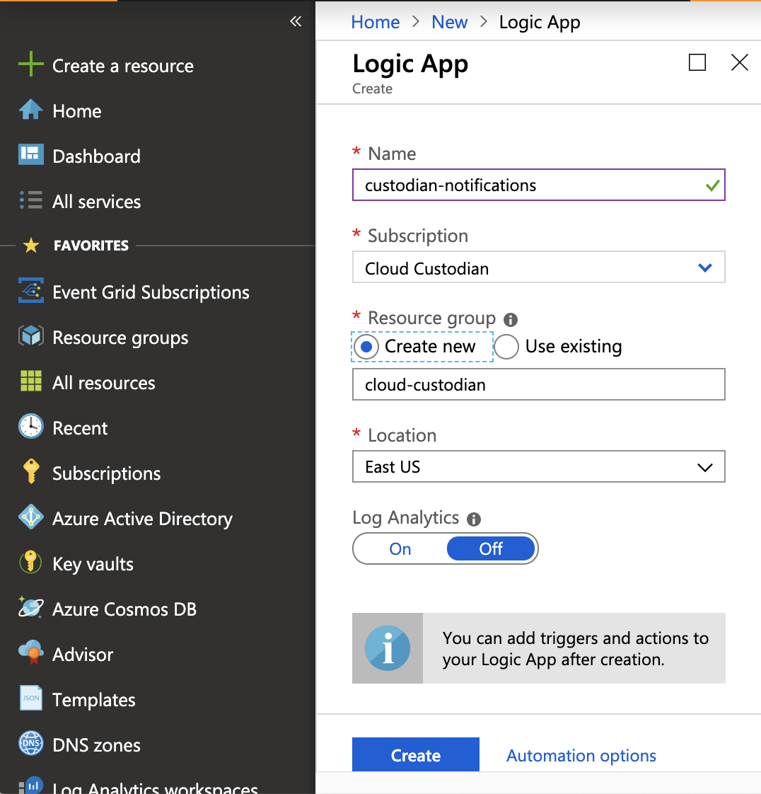
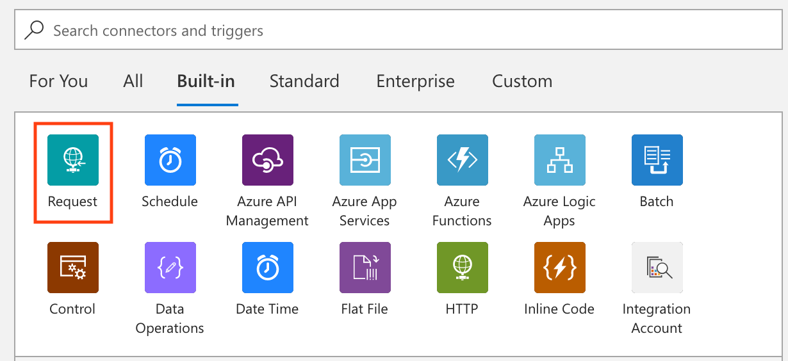
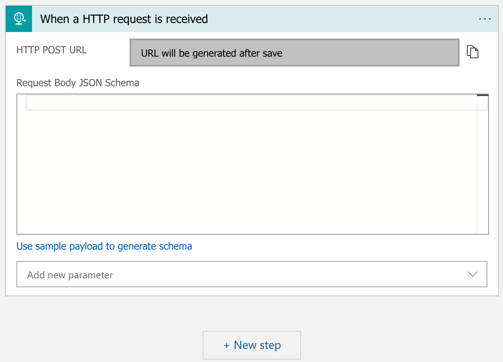
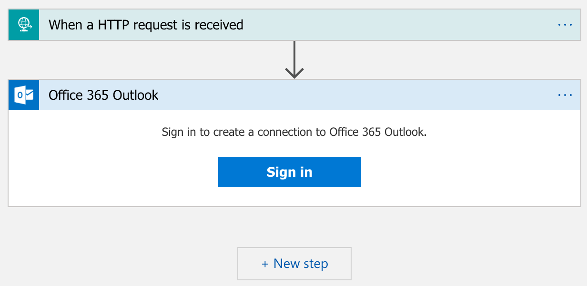
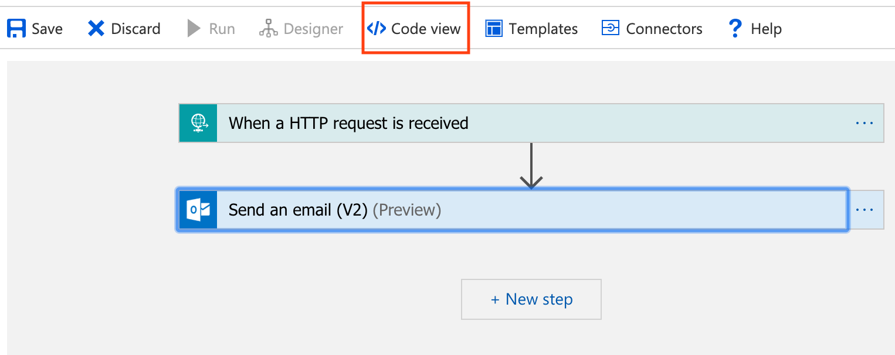
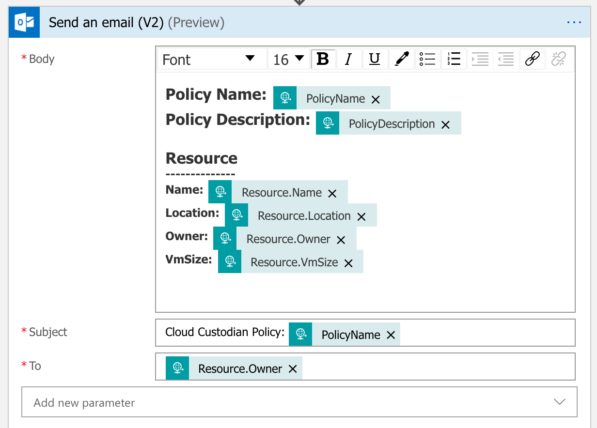
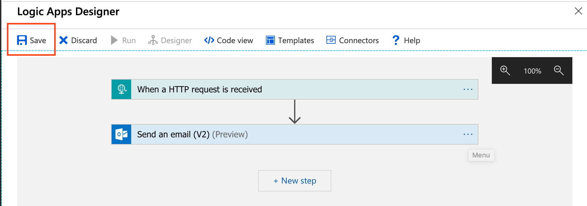
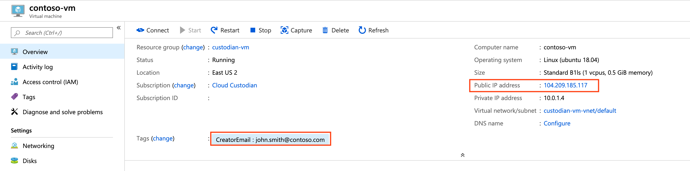
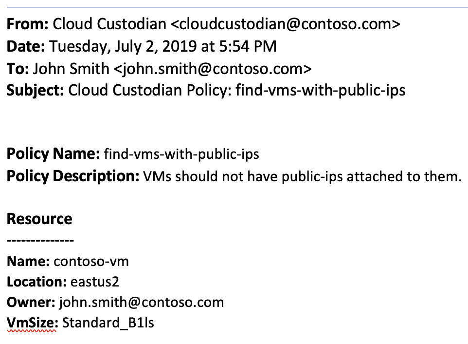

.. _azure_examples_notifications_logic_app:

Email - Use Azure Logic Apps to notify users of policy violations
=================================================================

Azure Logic Apps are a great option to create simple scalable workflows in Azure, such as sending an email or posting to Microsoft Teams.
In this example, we will create a workflow that is invoked by Custodian's :ref:`logic-app <Azure.common.actions.logic-app>` action.

Create and configure Azure Logic App
------------------------------------
We will now walk through the steps to configure a Logic Apps workflow that will consist of an `Request` trigger and an `Outlook send email` action.

Create a new Azure Logic App
~~~~~~~~~~~~~~~~~~~~~~~~~~~~
1. From the main Azure menu, choose **Create a resource ─▶ Integration ─▶ Logic App.**
2. Configure your logic app as shown below. For this example, let's name the Logic App **custodian-notifications**. After you're done, hit **Create**.

3. After the Logic App is created, go to the resource and select **Blank Logic App** under **Templates**.

Create Request trigger
~~~~~~~~~~~~~~~~~~~~~~
1. Under the **Built-in** tab, select **Request**.

2. Select **When a HTTP request is received**. This will setup a HTTP trigger for your Logic App.

Hitting the **Save** button will generate the URL that will be used to invoke your Logic App.

Create the Outlook Send Email action
~~~~~~~~~~~~~~~~~~~~~~~~~~~~~~~~~~~~

1. Click the **+ New Step** to create an action to send an email.

2. In the search box, search for **Send an email (V2)**. Under the **Actions** tab, select the **Office 365 Outlook** action.

.. image:: resources/f3.png

3. Sign into an Office 365 account to create a connection for your Logic App. This account will be used to send emails once the workflow is invoked.

4. Next, customize the email template that will be sent. Go to into the **Code View** mode by hitting the **Code View Button**.

5. Inside the **definition** property, update the **actions** property to look like the following:

.. code-block::

    "actions": {
      "Send_an_email_(V2)": {
          "inputs": {
              "body": {
                  "Body": "
<strong>Policy Name: </strong>@{triggerBody()['PolicyName']} \n<strong>Policy Description:</strong><strong> </strong>@{triggerBody()['PolicyDescription']} \n<strong> \n</strong><strong>Resource</strong><strong> \n-------------- \nName: </strong>@{triggerBody()['Resource']['Name']} \n<strong>Location: </strong>@{triggerBody()['Resource']['Location']} \n<strong>Owner: </strong>@{triggerBody()['Resource']['Owner']} \n<strong>VmSize: </strong>@{triggerBody()['Resource']['VmSize']} \n \n
",
                  "Subject": "Cloud Custodian Policy: @{triggerBody()['PolicyName']}",
                  "To": "@{triggerBody()['Resource']['Owner']}"
              },
              "host": {
                  "connection": {
                      "name": "@parameters('$connections')['office365']['connectionId']"
                  }
              },
              "method": "post",
              "path": "/v2/Mail"
          },
          "runAfter": {},
          "type": "ApiConnection"
      }
    }

6. Return back to the **Designer** mode. The template now appears in the **Send an email (V2)** action.

7. Save the workflow. We now have a Logic App workflow that can be invoked via a HTTP request to send an email with an Office 365 account.

Author Cloud Custodian policy
-----------------------------
Let's start with an existing policy such as the :ref:`Find Virtual Machines with Public IP address <azure_examples_vm_with_public_ips>` policy.
This policy will find all Azure Virtual Machines that have public IPs attached to them.

.. code-block:: yaml

    policies:
      - name: find-vms-with-public-ips
        description: |
          VMs should not have public-ips attached to them.
        resource: azure.vm
        filters:
          - type: network-interface
            key: properties.ipConfigurations[].properties.publicIPAddress.id
            value: not-null

Add Logic App action
~~~~~~~~~~~~~~~~~~~~

Add a :ref:`logic-app <Azure.common.actions.logic-app>` action to the policy to invoke the newly created Logic App.
This action expects a **CreatorEmail** tag to be added on each resource.
This can be done by Custodian using the :ref:`auto-tag-user <azure_examples_autotagusers>` policy.

.. code-block:: yaml

    actions:
      - type: logic-app
        resource-group: cloud-custodian            # ─▶ This is the resource group where you created your Logic App
        logic-app-name: custodian-notifications    # ─▶ This is the name of your Logic App
        batch: false                               # ─▶ We want to invoke the Logic App for each resource that violates our policy
        body: >                                    # ─▶ We will select specific properties of our resource that can be used in our Logic App
            {
            PolicyName: policy.name,
            PolicyDescription: policy.description,
            Resource: resource.
                {
                Name: name,
                Location: location,
                Owner: tags.CreatorEmail,                  # ─▶ The CreatorEmail tag on the resource will be recipient of the email.
                VmSize: properties.hardwareProfile.vmSize
                }
            }

Final updated policy
~~~~~~~~~~~~~~~~~~~~

.. code-block:: yaml

    policies:
      - name: find-vms-with-public-ips
        description: |
          VMs should not have public-ips attached to them.
        resource: azure.vm
        filters:
          - type: network-interface
            key: properties.ipConfigurations[].properties.publicIPAddress.id
            value: not-null
        actions:
          - type: logic-app
            resource-group: cloud-custodian
            logic-app-name: custodian-notifications
            batch: false
            body: >
              {
                PolicyName: policy.name,
                PolicyDescription: policy.description,
                Resource: resource.
                  {
                    Name: name,
                    Location: location,
                    Owner: tags.CreatorEmail,
                    VmSize: properties.hardwareProfile.vmSize
                  }
              }

Test the policy
---------------

Policy violating virtual machine
~~~~~~~~~~~~~~~~~~~~~~~~~~~~~~~~
Find a Virtual Machine with a **Public IP Address**, which is a violation of the :ref:`find-vms-with-public-ips <azure_examples_vm_with_public_ips>` policy.
Next, either manually add a **CreatorEmail** tag to it or execute the :ref:`auto-tag-user <azure_examples_autotagusers>` policy targeting `Virtual Machine` resources.

Email sent from logic app
~~~~~~~~~~~~~~~~~~~~~~~~~
When we execute the policy above, it will invoke the **logic-app** action, which will result in the following email to be sent:

