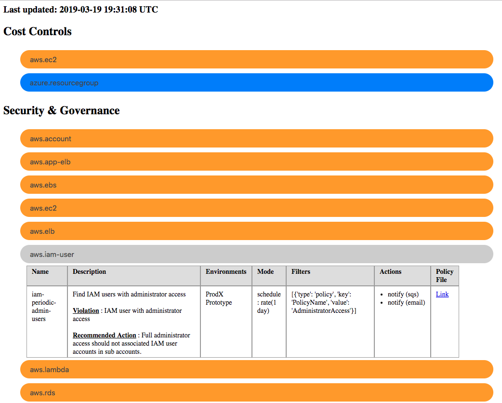

# Automated Cloud Custodian Policy Documentation

## What is c7n-autodoc?

Automated Cloud Custodian policy documentation for your business partners.

## Why use c7n-autodoc?

Administrators of cloud platforms need provide their business partners
with clear and accurate documentation regarding the security, governance and
cost control policies.  The easiest way to stay on top of your documentation 
is to automate it.  This utility will create an HTML file with easy to read information
regarding your existing Cloud Custodian policies.  

Features include:
* Automatically writes to S3 bucket
* Groups policies by resource type
* Groups policies by category (i.e 'Security & Governance' vs 'Cost Controls')
* Provide links to underlying file in GitLab/GitHub
* Uses policy tags to determine applicable environments

## Assumptions

* You have added any necessary security controls to the destination S3 bucket
* Local credentials exist for the boto3 module to push the file to S3

## Installation

<i>NOTE: Requires python3</i>

  pip3 install pyyaml boto3 jinja2 jsonschema

## Configuration

The only item you should need to customize is the configuration YAML file which is required by the 
script.  Look at the example file provided to determine which fields are required and which 
are optional.  You can also customize the jinja2 template to further modify the HTML 
documentation which is created. 

The S3 bucket which will house the HTML file needs to have `Static website hosting` enabled.  The 
default (index.html, error.html) are fine because you will be directly targeting the c7n-autodoc.html
file.

## Run

For the best results this script should be run as a part of a CI/CD pipeline. 

  python3 c7n-autodoc.py -c my_config_file.yml

Assuming there aren't any issues you should see the HTML file in the S3 bucket.

## Example 

## TODO

* Account for different policies for proper rendering
* Improved UI layout
* Easier user setup
